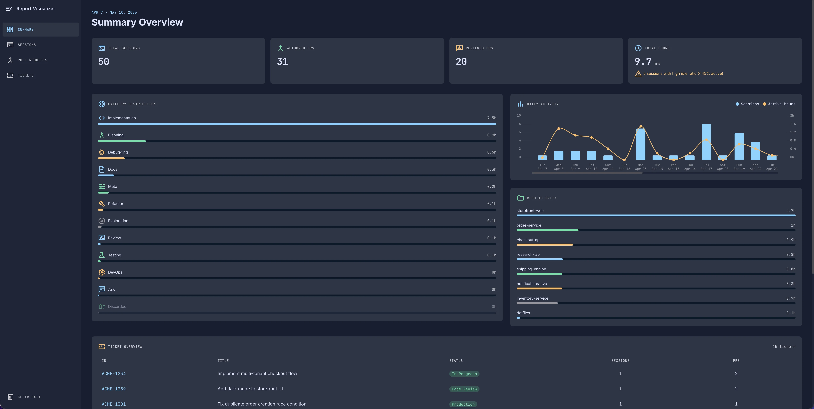
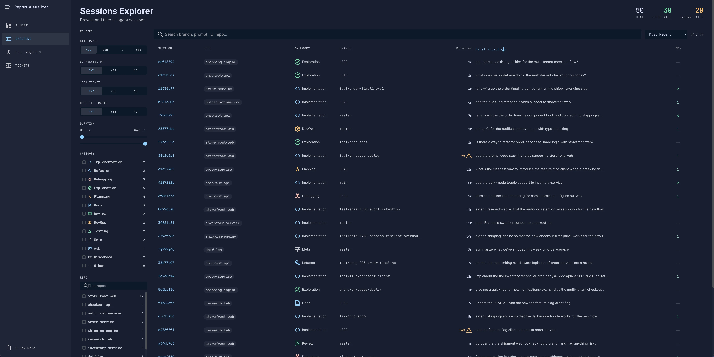
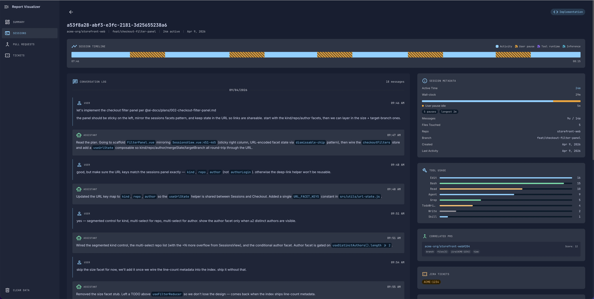

# Dev Digest Visualizer

A client-side dashboard for visualizing dev digest reports — sessions, pull requests, and tickets — with no backend, no auth, and no data leaving your browser. Built with Vue 3, Vite, Tailwind CSS v4, and Chart.js.

**Live demo:** https://abdelrahman-elkady.github.io/dev-digest-visualizer/

Reports are generated by [claude-dev-digest](https://github.com/abdelrahman-elkady/claude-dev-digest). Export the JSON, drop it into the visualizer, and explore.

## Screenshots





## Develop

```bash
npm install
npm run dev
```
